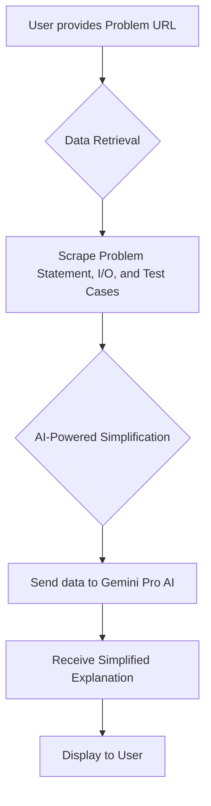

# ProblemEZ - AI-Powered Programming Problem Simplifier

This project is a tool that simplifies programming problems from platforms like Codeforces. You provide a URL to a problem, and the tool scrapes the problem statement, input/output specifications, and sample test cases. It then uses a powerful generative AI to provide a simplified, more understandable version of the problem.

## Features

- 🔍 **Smart Web Scraping**: Uses undetected Chrome driver to reliably scrape problem data
- 🤖 **AI-Powered Analysis**: Leverages Google Gemini AI for intelligent problem simplification
- 📊 **Comprehensive Data Extraction**: Extracts problem statements, input/output specs, and test cases
- 🎯 **User-Friendly Interface**: Simple command-line interface with loading indicators
- 🔧 **Modular Architecture**: Clean, maintainable code structure with separate components

## How it Works



1. **Data Retrieval**: The tool uses undetected Chrome driver and BeautifulSoup to scrape the problem data from the provided URL.
2. **AI-Powered Simplification**: The scraped data is then sent to the Google Gemini Pro AI model, which analyzes the problem and generates a simplified explanation.
3. **Output**: The simplified problem is then displayed in your console with a user-friendly loading indicator.

## Project Structure

```text
ProblemEZ/
├── main.py              # Entry point of the application
├── requirements.txt     # Project dependencies
├── README.md           # Project documentation
├── cp-env/             # Virtual environment
├── src/                # Source code directory
│   ├── app.py          # Main application logic
│   ├── agent.py        # AI agent handling Gemini integration
│   ├── data_retrieval.py # Web scraping functionality
│   ├── driver.py       # Chrome driver configuration
│   └── problem_handler.py # Problem data processing
└── utils/              # Utility modules
    └── prompts.py      # AI prompts and templates
```

## Installation

1. **Clone the repository:**

    ```bash
    git clone https://github.com/al-sakka/ProblemEZ.git
    cd ProblemEZ
    ```

2. **Create a virtual environment:**

    ```bash
    python -m venv cp-env
    source cp-env/bin/activate  # On Windows, use `cp-env\Scripts\activate`
    ```

3. **Install dependencies:**

    ```bash
    pip install -r requirements.txt
    ```

4. **Set up ChromeDriver:**

    This project uses undetected Chrome driver which automatically manages ChromeDriver installation. Simply ensure you have Google Chrome installed on your system.

5. **Set up your API Key:**

    This project uses the Google Gemini API. You need to set your API key as an environment variable:

    ```bash
    export GEMINI_API_KEY='your_api_key_here'
    ```

    On Windows, you can set it with `set GEMINI_API_KEY=your_api_key_here` for the current session, or use a `.env` file in the project root.

## Usage

1. Make sure your virtual environment is activated and the `GEMINI_API_KEY` is set.

2. Run the application:

    ```bash
    python main.py
    ```

3. When prompted, enter the full URL of the programming problem you want to simplify:

    ```text
    Enter Problem URL: <paste-the-problem-url-here>
    ```

4. The tool will then scrape the page, process it with the AI, and print the simplified explanation to your console.

## Dependencies

- **selenium**: Web automation and scraping
- **beautifulsoup4**: HTML parsing
- **google-genai**: Google Gemini AI integration
- **yaspin**: Loading indicators
- **undetected-chromedriver**: Stealth web scraping
- **python-dotenv**: Environment variable management

## Contributing

Feel free to open issues or submit pull requests to improve this tool!

## License

This project is open source. Please check the repository for license details.