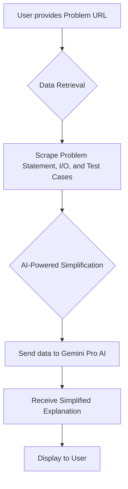

# AI-Powered Programming Problem Simplifier

This project is a tool that simplifies programming problems from platforms like Codeforces. You provide a URL to a problem, and the tool scrapes the problem statement, input/output specifications, and sample test cases. It then uses a powerful generative AI to provide a simplified, more understandable version of the problem.

## How it Works



1.  **Data Retrieval**: The tool uses Selenium and BeautifulSoup to scrape the problem data from the provided URL.
2.  **AI-Powered Simplification**: The scraped data is then sent to the Google Gemini Pro AI model, which analyzes the problem and generates a simplified explanation.
3.  **Output**: The simplified problem is then displayed in your console.

## Installation

1.  **Clone the repository:**
    ```bash
    git clone <repository-url>
    cd <repository-directory>
    ```

2.  **Create a virtual environment:**
    ```bash
    python -m venv venv
    source venv/bin/activate  # On Windows, use `venv\Scripts\activate`
    ```

3.  **Install dependencies:**
    ```bash
    pip install -r requirements.txt
    ```

4.  **Set up ChromeDriver:**
    This project uses Selenium to scrape web content, which requires the Chrome web browser and ChromeDriver.
    - Make sure you have Google Chrome installed.
    - Download the version of ChromeDriver that corresponds to your Chrome version from the [official site](https://chromedriver.chromium.org/downloads).
    - Place the `chromedriver` executable in a directory that is in your system's PATH.

5.  **Set up your API Key:**
    This project uses the Google Gemini API. You need to set your API key as an environment variable.
    ```bash
    export GEMINI_API_KEY='your_api_key_here'
    ```
    On Windows, you can set it with `set GEMINI_API_KEY=your_api_key_here` for the current session, or set it permanently through the system properties.

## Usage

1.  Make sure your virtual environment is activated and the `GEMINI_API_KEY` is set.
2.  Run the application:
    ```bash
    python main.py
    ```
3.  When prompted, enter the full URL of the programming problem you want to simplify.
    ```
    Enter Problem URL: <paste-the-problem-url-here>
    ```
4.  The tool will then scrape the page, process it with the AI, and print the simplified explanation to your console.
